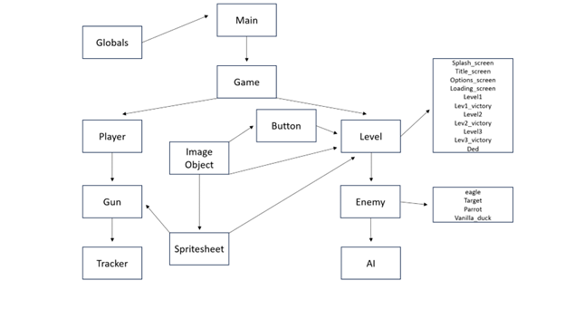

# DuckHunt-WorldWar 
by Ankit, Nathan, Alex and Robert

Overview of the project:

This game is based on the popular 80's game "Duck Hunt" but with a twist: the duck (or birds) shoot back at the player
this turns the game into more of a First Person Shooter where they can move left and right and duck under cover. Another fun twist is the way you aim:
Either you can use the mouse or use the computer's camera to track a makeshift controller that the player can use to aim and shoot.  

In terms of design, we wanted to keep the 8-bit art style of the original game. The original game layout consists of a background, a middleground bush the enemy comes out of and a 
foreground bush that the player is behind. In our game, we made 3 maps: Africa, Australia and America. Each of the maps had their own respective background, middleground and 
foreground. Another thing we wanted was a simple and easy UI, with a similar style in button design with the 8-bit style of the game. After the completion of each level, there is 
a success screen, and we wanted that to break up the pace of the game as well as add to the user experience. The player aspect of the design (crosshair, weapon, etc) is not as 
similar to the base game. We wanted to improve one aspect of the game - ours has a crosshair which allows the player to aim and fire, making it easier to play the game. Finally, 
to add some sense of difficulty, we added a reload time, shown by the green circle around the crosshair and also, the enemy shooting which is shown by the red circle shrinking 
down on its target over time.

Instructions for running the game:

In VS Code, go into the terminal and pip install the following: pygame, numpy, opencv, cypy

Make sure the user has a camera and it is not covered or in a badly lit area as that is how the game tracks the controller. 
Make sure there is a functional mouse, whether that be a physical mouse or a track pad.
To run the game, run the "main.py" file in the "main" folder 

Architecture:

For the interactions, the biggest ones can be seen in the image below; that shows how all the major classes and abstract classes interact in the tightly wound system. For the smaller interactions, they'll be described here: to start, the main.py calls game.py which is the whole management system of the game. For that, each level is made into its own class, which is then imported and put into a list which the game moves through. For the levels that have buttons, each button is a piece of the button.py class. Each button is designed with a function, some of which actually have the ability to +1 or -1 in the level list. Every single image you see in the game, is a child of the ImageObject class, which takes the image and gives it certain attributes that we can work with and manipulate. For the gun tracking, the system scans a QR code on the gun through the camera. From there, the relative location of the gun is mirrored onto the screen and acts as a cursor. The gun is tracked in the PhysicalGunDetection.py file, and it distributes information to the rest of the game through it, since it is running the whole time. In the levels with enemies, the level itself handles the tracking of the enemy, the cursor and the health of the enemy. 

For the majority of the Modules, we made an abstract class that outlined the basic form. For example, the level.py and enemy.py file are abstract classes that are implemented into each level or enemy respectively. We did this to reduce the redundancy of coding and make the coding process as a whole more efficient. Another choice made was the game management system. There is a main.py class that is the main game and the game.py class that allows us to easily manage the game and the levels in a simple way. Finally, in our globals.py class, we made all the "things" we would need to use multiple times, such as images and variables in one class. This allowed for ease of importing when creating new levels and enemies.
Below is a sturcture diagram of the code:

The APIs of the system:

Retrospective:

Overall, the process for writing this app was great, as we were able to get a finished game, despite it not being what we imagined it to be at the beginning of the project. We had a very solid structure that took several evolutions and made designing levels and everything on it very efficient and easy to do; our artwork was great and added a really nice touch to the gam; and our tracking system and the tracker that we designed worked very well (adding a nice touch to the game), and we were able to optimize it to run the game at good fps levels .

However, despite this, our communication as a group could be improved upon. Looking on the good side, we would have very good stand ups with very concise and meaningful progress checks on how we were doing on our respective tasks; discuss issues in code and ways to fix them; and assign tasks for the day. Furthermore, during work time, we would explain our code structure and logic to other group members so we could integrate our code, and we would collaboratively debug and design various parts of our code. 
But, when we were out of class, we would rarely communicate with each other, and we would kind of do our own things without really talking with anyone else in the group. To fix this in future projects, we could have designated specific times over the weekends to call and discuss, send progress reports in the group chat we created, or utilize GitHub Tasks more often as we rarely used it to divvy out work and discuss problems. 

The only major surprise that our group faced was the fact that we might not be able to finish our planned game by the project deadline. However, this did not throw us off too much as we met as our group and decided on ways to downscale our project (removing enemies, levels, and special gun features) to create a more manageable game to finish on time. Other than this, there weren’t any big roadblocks. Of course, there were typical code issues and optimization problems (some of which required us to redesign classes and structure to improve modularity and efficiency), but we were able to fix most of these issues without much problem, and none of them required us to redesign actual parts of our game. 

The one thing that our group should have done differently is coming up with the structure of the game at the beginning of the project. At the beginning of the project, we never really discussed the structure of the code, and we all did our own experimenting with the game with our own branches. After we did all our experimenting, we never really had a defined structure, so we had all this code, and we didn’t know how we wanted to put it together. This created a lot of confusion, and once we did figure out our structure, we had to spend a lot of precious time rewriting our code to integrate it within the structure which wasted a lot of time. Therefore, I think it would be beneficial to create our architecture at the beginning of the project and then work directly in it, which saves us time.  
